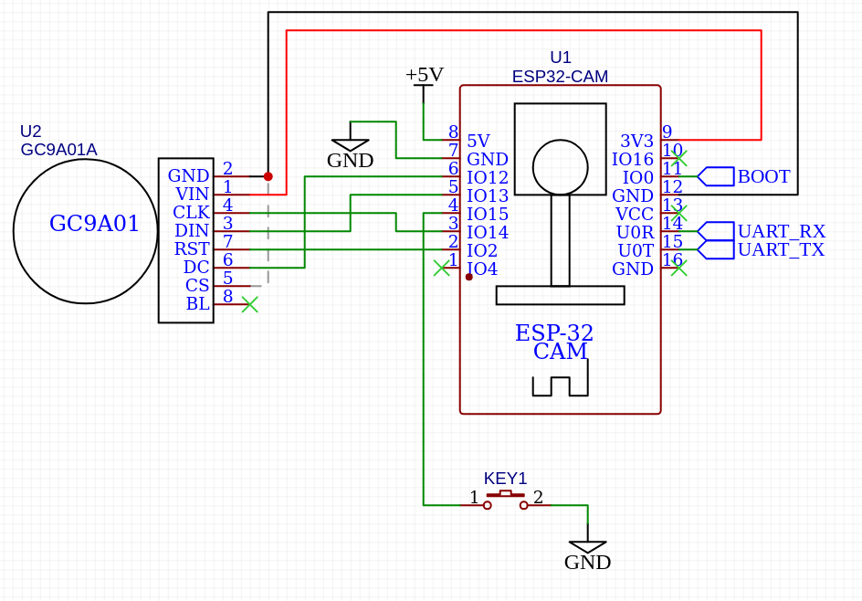

# ESP32-DNVG

## Tested with

|          | OV2640  | OV7725  |
|:--------:|:-------:|:-------:|
| ESP-32s  |    ✅   |    ?    |

## Parts i used

## 3D printed files

[brige](https://www.printables.com/model/1109483-uf-nvg-based-on-pvs-69-alpha)
Housing from [discord](https://discord.gg/KSq6EumnWx) channel community-made-files from user xx‾ɹoʇʞɐɹʇ‾xx

## Schematic

## Features

 1. Onscreen menu
    - Changing filter
        - No Effect, Negative, Grayscale, Red Tint, Green Tint, Blue Tint, Sepia
    - Rotation of display
        - 0, 90, 180, 270
    - White balance
    - Restoring setings back
    - Setings are saved, when exiting from menu
    - FPS counter
    
  2. Some debug info on serial

